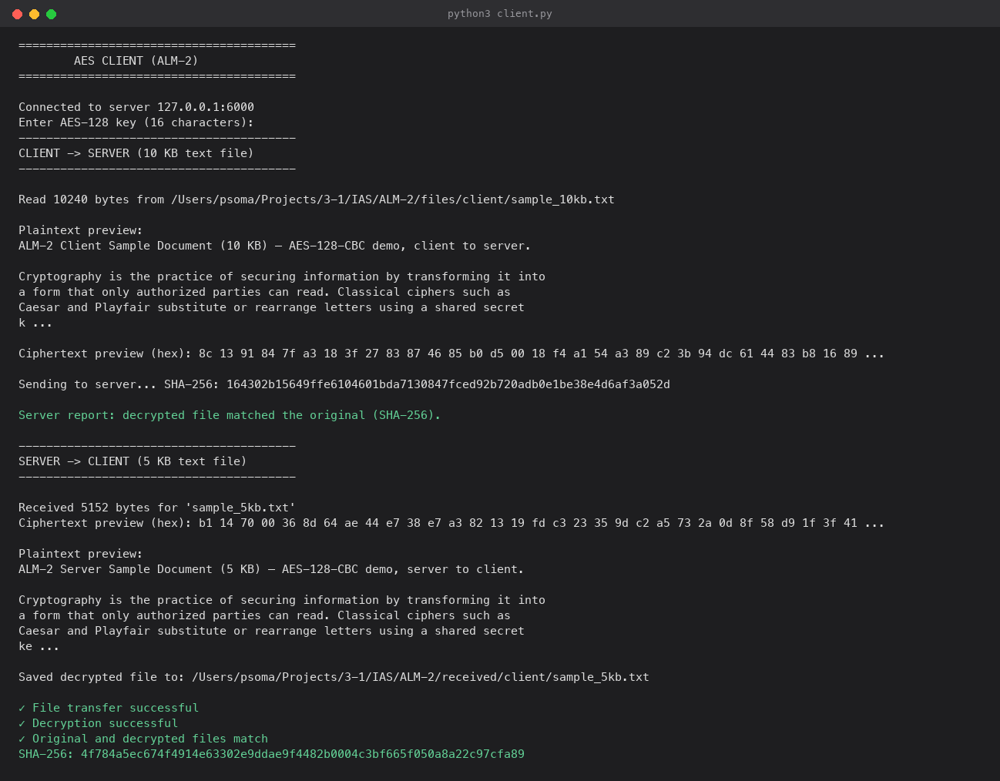
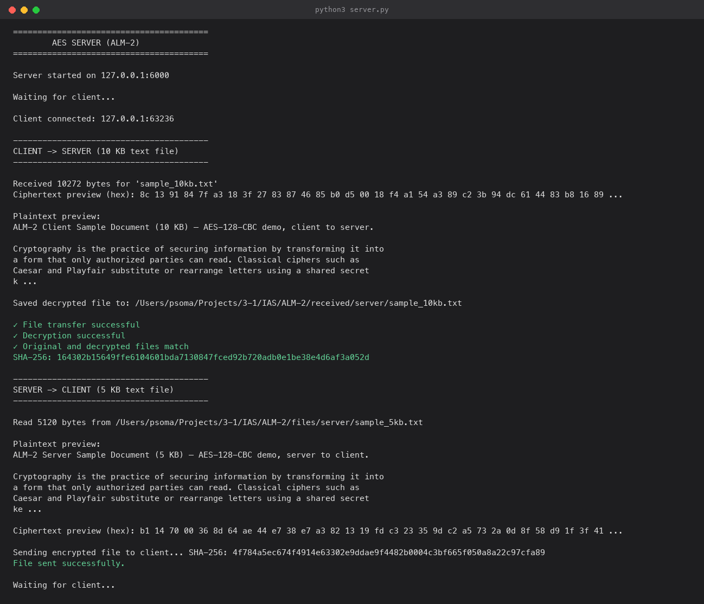

# ALM-2 AES Client-Server File Transfer

**Name:** Ajithesh
**Roll No:** 2420030109
**Section:** 11

## 1. Project Title

AES Client-Server Text File Transfer — AES-128-CBC via PyCryptodome over TCP sockets.

## 2. Objective

Extend the ALM-1 socket/cipher lab to a modern block cipher: use the
PyCryptodome library's AES implementation (instead of hand-rolled SDES) to
encrypt and transfer human-readable text files between a client and a
server, in both directions, over a real TCP connection.

## 3. Technologies Used

- Python 3 standard library: `socket`, `struct`, `json`, `hashlib`.
- [PyCryptodome](https://pycryptodome.readthedocs.io/) for AES itself —
  this is the one piece of the assignment explicitly meant to use a real
  crypto library rather than a from-scratch implementation.

## 4. Algorithm

AES-128 in CBC mode (`algorithms/aes_cipher.py`):

- 16-byte (128-bit) key, entered by the user as a 16-character string.
- A fresh random 16-byte IV is generated for every encryption call
  (`Crypto.Random.get_random_bytes`) and prepended to the ciphertext, so
  the receiver can recover it without a separate exchange. Reusing an IV
  across messages is the classic CBC mistake — a new one every time
  avoids it.
- PKCS#7 padding (`Crypto.Util.Padding.pad`/`unpad`) brings the plaintext
  up to a multiple of the 16-byte AES block size before encryption, and
  strips it back off after decryption.
- The key itself is sent to the server inside the request's JSON header,
  in the clear — this mirrors the ALM-1 SDES design (same simplification:
  the lab is about demonstrating the cipher and the socket transfer, not
  key-exchange protocols like Diffie-Hellman).

## 5. Client-Server Architecture

Same framed protocol as ALM-1 (`network/protocol.py`):
`[4-byte header length][JSON header][raw payload bytes]`, with
`recv_exact()` looping over `recv()` in 4 KB chunks so a 10 KB payload is
received no differently than a short message.

One TCP connection carries both legs of the exchange:

```
CLIENT                                    SERVER
  |--- connect() ---------------------------->|
  |--- FILE_TRANSFER (10 KB ciphertext) ----->|  decrypt, save, verify
  |                                            |  read its own 5 KB file
  |<-- FILE_ACK (5 KB ciphertext) -------------|  encrypt
  decrypt, save, verify                        |
  |--- close ----------------------------------|
```

## 6. How to Install / Run

```bash
cd ALM-2
python3 -m pip install -r requirements.txt
```

## 7. How to Start the Server

```bash
python3 server.py
```

Binds to `127.0.0.1:6000` and waits for a client.

## 8. How to Start the Client

In a second terminal:

```bash
python3 client.py
```

Enter any 16-character AES key when prompted (the server must use the
same key — it receives it from the client automatically in this demo).

## 9. Requirement Mapping

1. **Client → Server (10 KB text):** client reads
   `files/client/sample_10kb.txt` (10,240 bytes, human-readable), encrypts
   it, prints the plaintext and ciphertext previews, sends it.
2. **Server → Client (5 KB text):** on the same connection, the server
   reads `files/server/sample_5kb.txt` (5,120 bytes, a different
   document), encrypts it, prints both previews, and sends it back.

Both sides save what they received (`received/server/`,
`received/client/`) and verify the decrypted file against a SHA-256 sent
alongside the ciphertext, printing:

```
✓ File transfer successful
✓ Decryption successful
✓ Original and decrypted files match
SHA-256: <64 hex characters>
```

## 10. Testing

```bash
python3 -m unittest discover -s tests -v
```

`tests/test_aes_cipher.py` covers: key length validation, encrypt/decrypt
round-trip (short text, exact block multiple, empty input), that two
encryptions of the same plaintext differ (proving the IV is random each
time), rejecting a wrong key, and a full round-trip against the real
10 KB / 5 KB sample files.

## 11. Screenshots

Real output from an actual `client.py` / `server.py` run (rendered as
terminal-style images from the captured text, since this environment has
no interactive display to screenshot directly):

**Client:**



**Server:**


